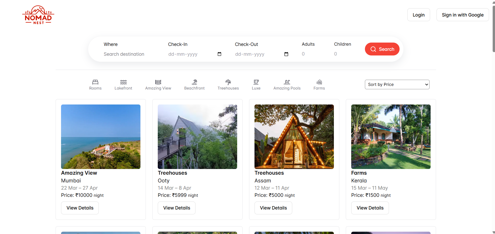
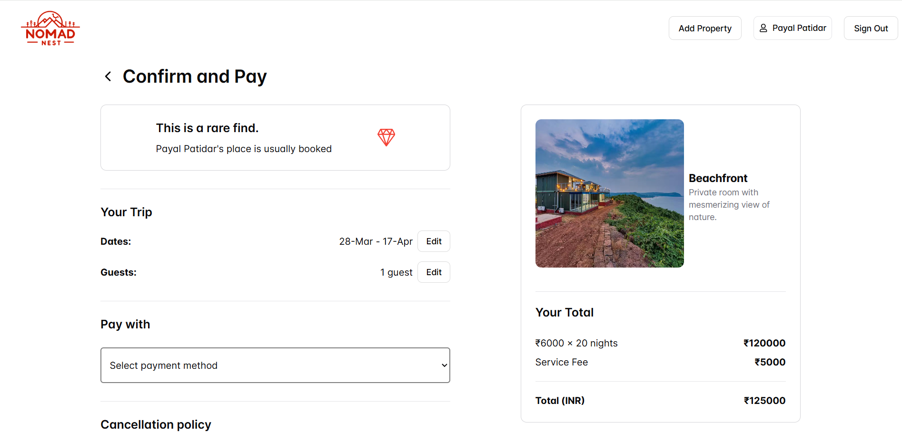
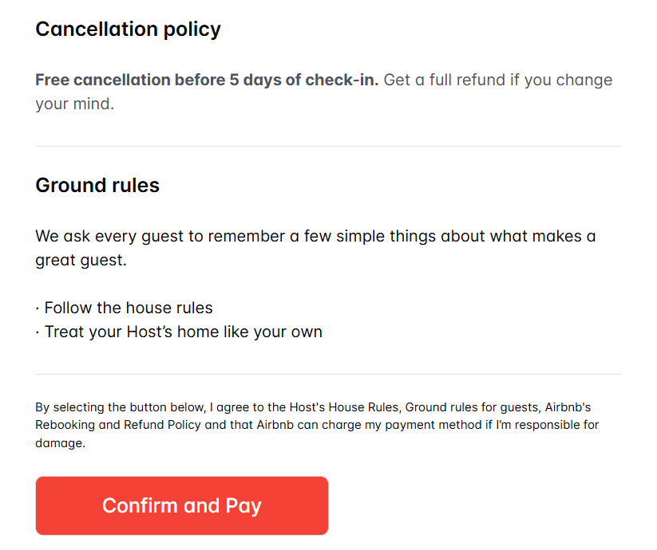

# NomadNest

NomadNest is a platform designed to redefine travel experiences, offering travelers a seamless way to find and book unique accommodations worldwide. Inspired by the spirit of adventure and the comfort of home, NomadNest bridges the gap between wanderlust and luxury, providing handpicked stays tailored to every traveler’s needs.

## 🌍 Welcome to NomadNest

NomadNest is your gateway to extraordinary stays across the world. Whether you're looking for cozy cabins, beachfront villas, or city apartments, we bring you a carefully curated selection of accommodations that promise comfort and authenticity. With easy navigation, secure booking options, and a variety of categories, finding your next perfect stay has never been easier!

---

## 💻 Tech Stack:
- HTML
- CSS
- JavaScript
- React
- Redux
- Chakra UI
- Firebase

---

## 🌐 Socials:
Pallavi Patidar - https://www.linkedin.com/in/pallavi-patidar-8466a7273/

---

## 🚀 Project Type
**Frontend | Backend | Fullstack**

---

## 🔗 Deployed App
**Frontend:** https://nomad-nest-firebase.web.app

---

## ✨ Features
✅ **Diverse Property Listings:** Browse various property types, including beach houses, treehouses, farms, and luxury stays.
✅ **Intuitive Navigation:** Simple and efficient category-based filtering for easy exploration.
✅ **User Authentication:** Secure login and signup using Firebase authentication.
✅ **Dynamic Property Details Page:** View high-quality images, descriptions, pricing, and location details.
✅ **Search & Filter Functionality:** Sort properties by price, location, or category.
✅ **Responsive Design:** Optimized for mobile and desktop users.

---

## 📸 Screenshots
### 🏠 Home Page

### 🏡 Property Details

### 🛒 Checkout Page

### 🏕️ Add Property

---

## 🛠️ Technology Stack
- **React.js**: For building a dynamic user interface.
- **Redux**: For efficient state management.
- **Chakra UI**: For seamless and responsive styling.
- **Firebase**: For user authentication and database management.
- **HTML & CSS**: For structuring and styling web pages.
- **JavaScript**: For adding interactivity and dynamic behavior.

---

## 🙌 Thank You!
Thank you for exploring **NomadNest**. We hope you enjoy using the platform as much as we enjoyed building it. Happy traveling! ✈️🌍

